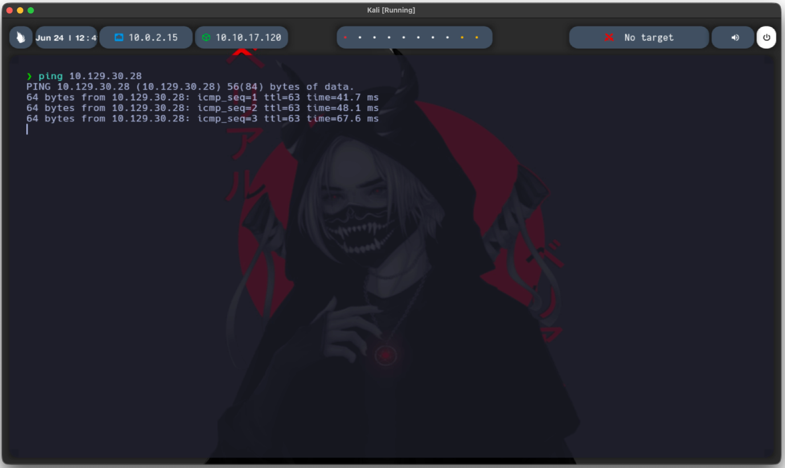
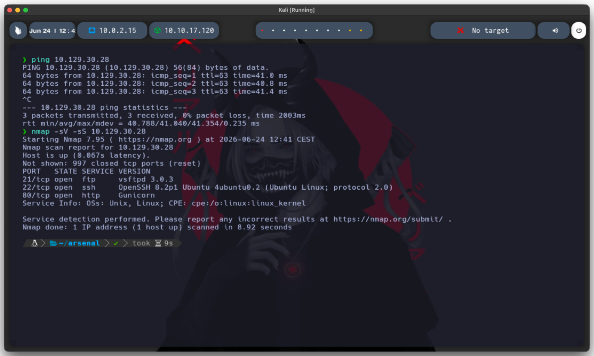
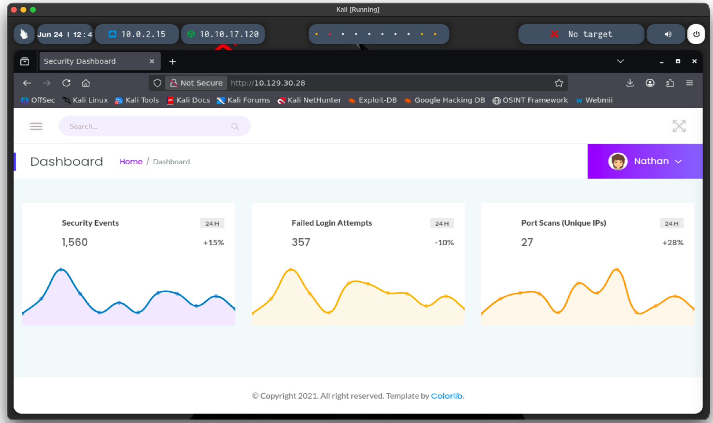
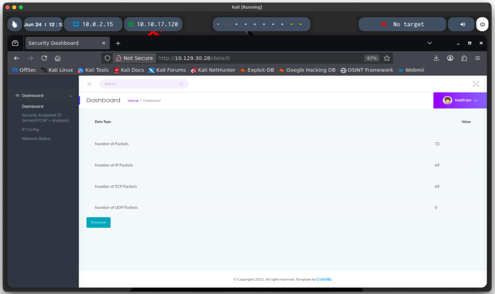
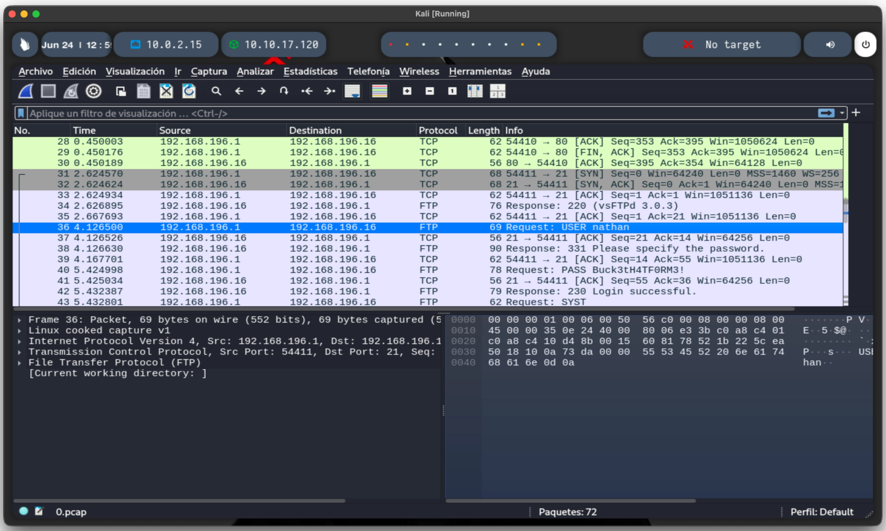

# CAP — HackTheBox

**Difficulty:** Easy
**OS:** Linux
**Date:** June 2026

## Summary

Cap is an Easy-rated Linux machine on HackTheBox. The name hints at its two core concepts: **PCAP** network captures and **Linux capabilities**. A web application exposes network traffic captures through an IDOR vulnerability, leaking FTP credentials in cleartext. These credentials grant SSH access, and privilege escalation is achieved through a misconfigured Python capability.

## Reconnaissance

### Connectivity check

Before scanning, a quick ping confirms the host is up and gives an early clue about the OS:

```bash
ping 10.129.30.28
```

The response comes back with **TTL 63**, which points to a Linux target — Windows hosts typically reply with TTL 127 or 128. This helps decide which enumeration paths are worth prioritizing later (e.g. Linux capabilities over Windows services).



### Port scanning

With the host confirmed alive, the next step is identifying open ports and the services behind them:

```bash
nmap -sV -sS 10.129.30.28
```

`-sS` was used for a fast SYN scan, and `-sV` to fingerprint service versions — version info matters here because it can point to known, exploitable software.



**Results:**

| Port | Service | Version |
|---|---|---|
| 21 | FTP | vsftpd 3.0.3 |
| 22 | SSH | OpenSSH 8.2p1 (Ubuntu) |
| 80 | HTTP | Gunicorn (Python WSGI server) |

Three services stand out for different reasons:

- **FTP (21):** worth keeping in mind since it transmits everything — including credentials — in cleartext, and sometimes allows anonymous login.
- **SSH (22):** not directly useful yet, since no credentials are available at this point.
- **HTTP (80):** the most promising entry point, since it's a custom web app rather than a default service — a good candidate for logic flaws.

## Web Enumeration and IDOR Vulnerability

Browsing to port 80 leads to a **Security Dashboard** belonging to a user named `nathan`.



The sidebar includes a **"Security Snapshot"** section that generates network reports. Opening one loads a URL ending in `/data/1` — a numeric, sequential ID is usually worth testing for IDOR, since it suggests reports aren't scoped per-user on the backend. That specific report doesn't contain anything useful, but the ID pattern is the real finding here.

Testing the theory by manually changing the ID to `/data/0` confirms it: the app returns a **previous report that shouldn't be accessible**, revealing a packet capture with 72 recorded packets. This is a classic **Insecure Direct Object Reference (IDOR)** — the app trusts the ID in the URL without checking whether it belongs to the current session.



## Traffic Analysis and Credential Extraction

The exposed report allows downloading a `.pcap` file. Since it's a packet capture, the logical next step is opening it in **Wireshark** to inspect what was recorded — if this capture was accessible without authentication, there's a good chance it holds something sensitive.



Filtering for FTP traffic specifically makes sense here, since FTP was already flagged earlier as cleartext. Following the TCP stream confirms the assumption — the full authentication exchange is visible in plain text:
