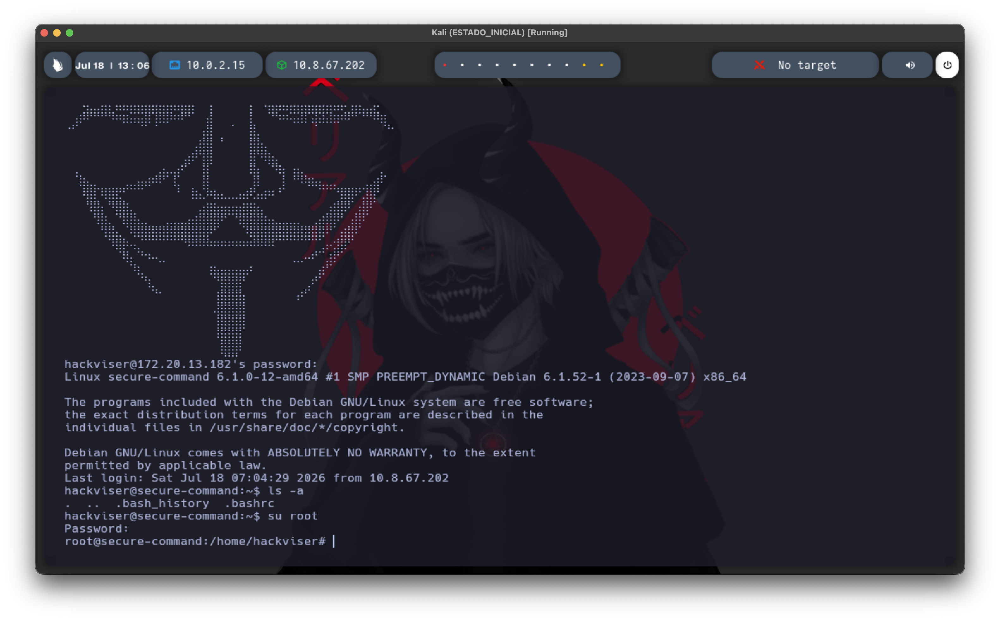
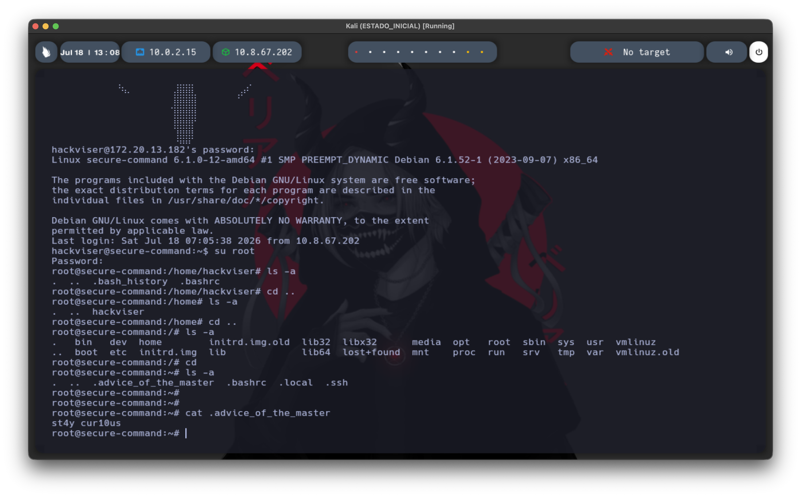

# Secure Command — Hackviser

**Difficulty:** Warmup
**OS:** Linux (Debian)
**Date:** [completar fecha]

## Summary

Secure Command is a warmup lab on Hackviser focused on the fundamentals of SSH access and basic Linux privilege escalation. It uses default/weak credentials as the initial access vector and a trivial `su` password reuse issue to reach root, closing with a simple filesystem enumeration exercise to locate a hidden flag file.

## Initial Access

The lab provides a set of credentials directly (`hackviser:hackviser`), so no prior enumeration is needed to get a foothold — the focus here is on the SSH connection process itself rather than discovery.

```bash
ssh hackviser@172.20.13.182
```

Authenticating with the given credentials succeeds and drops into a shell as the `hackviser` user. The login banner reveals a **"Master's Message"** — a small ASCII-art Easter egg — hinting that there's more to explore beyond just logging in.


## Privilege Escalation

With a shell as `hackviser`, the next logical step is checking whether the current user can escalate to root. `su` is the standard tool for switching users on Linux:

```bash
su root
```

This prompts for root's password. Since no credentials for root were provided, the approach here is to try common/default passwords rather than anything more advanced — a reasonable first move on a warmup-tier box before reaching for tools like `sudo -l` or looking for misconfigurations.

Trying `root` as the password for the `root` account works immediately, confirming a classic weak-credential issue: the most privileged account on the system was protected by its own username as the password.

```bash
su root
Password: root
```



## Post-Exploitation — Locating the Flag

With root access, the goal shifts to finding whatever "advice" or flag the lab is pointing to. Since the hint mentions checking the filesystem, hidden files are the natural place to start — anything prefixed with `.` won't show up under a plain `ls`:

```bash
ls -a
```

Browsing from the `hackviser` home directory up through `/home` and `/`, and finally checking root's own home directory, surfaces a hidden file that stands out immediately:


Reading it with `cat` reveals the flag:

```bash
cat .advice_of_the_master
```


## Lessons Learned

- Default or username-as-password credentials remain one of the most common — and most trivially exploitable — misconfigurations, even for high-privilege accounts like root.
- Hidden files (`.` prefix) are an easy place to overlook important data; `ls -a` should be a reflex during any post-access enumeration, not an afterthought.
- Even in a guided warmup, the underlying pattern (weak auth → privilege escalation → filesystem enumeration) mirrors the basic flow of most real-world Linux compromises, just without the discovery phase.
